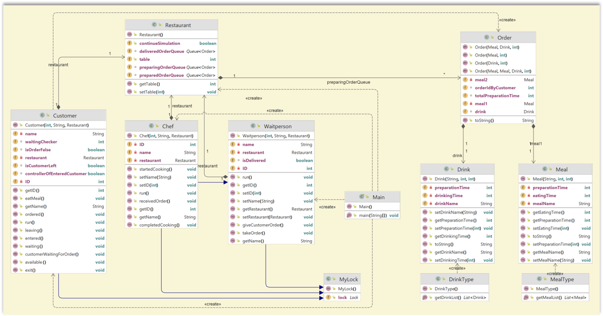

# Restaurant-finalproject-UPSchool

Java Bootcamp Bitirme Projesi ( OOP - Multithreading )

Bu projede bir lokantayı simule edeceksiniz. Lokanta tabi olarak aynı anda pek çok müşteriye hizmet vermektedir. Müşterilerden istekleri alan garsonlar, vardır. İstekler yemek ve içecekten oluşabilir. Müşteri en çok iki yemek ve bir içecek ısmarlayabilir. Garsonlar istekleri mutfakta çalışan şeflere iletir. Tabi olarak lokantadaki garson sayısı şef sayısından fazladır ve sıklıkla da müşteri sayısı garson sayısından fazla olmaktadır. Dolayısıyla müşterilerin istekleri garsonlar tarafından şeflere iletildiğinde şefler gelme sırasına göre yemek ve içecekleri hazırlarlar. Yemek ve içeceklerin hazırlanması zaman alacaktır. Bu sürede müşteriler masalarında beklerler.

Lokantada sınırlı sayıda masa vardır ve zaman zaman müşteri sayısı masa sayısını geçebilir. Bu durumda müşterileri bir miktar bekletmek gerekebilir. Müşterilerden beklemek istemeyenler olabileceği gibi masa boşalıncaya kadar beklemeyi tercih edenler de olabilir. Her müşteri ancak ısmarladığı yiyecek ve içecekler hazırlanıp onları tüketebilecek kadar masada oturabilir, sonrasında ayrılır.

Müşteriler belli aralıklarla lokantaya gelirler. Garsonlar ve şefler birbirlerinden bağımsız olarak istekleri yerine getirirler.

•	Müşteri, garson, şef ve masayı tasarlayın.
•	Yemek ve içecekleri belirleyin ve tasarlayın.
•	Yemek ve içeceklerin hazırlanma ve tüketilme sürelerini mili second cinsinden belirleyin.
•	Müşteri, şef ve garsonun yaptıklarının konsola basılacak basit loglar ile görülmesini sağlayın.

