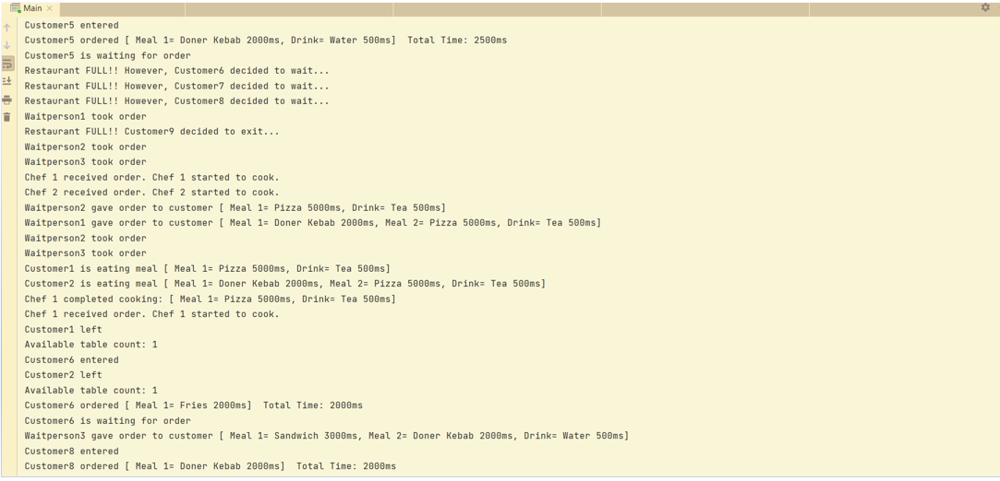

# Restaurant-finalproject-UPSchool

_**Java Bootcamp Graduation Project ( OOP - Multithreading )**_

**-What to do in the project-**

*In this project, you will simulate a restaurant. The restaurant naturally serves many customers at the same time. There are waiters, who take requests from customers. Requests can consist of food and drink. The customer can order a maximum of two meals and one drink. The waiters forward the requests to the chefs working in the kitchen. Of course, the number of waiters in the restaurant is more than the number of chefs, and often the number of customers is more than the number of waiters. Therefore, when the requests of the customers are conveyed to the chefs by the waiters, the chefs prepare the meals and drinks in the order they arrive. Meals and drinks will take time to prepare. During this time, customers wait at their tables.
The restaurant has a limited number of tables and at times the number of customers may exceed the number of tables. In this case, it may be necessary to wait for some customers. There may be those who do not want to wait from the customers or those who prefer to wait until the table is empty. Each customer can only sit at the table long enough to prepare and consume the food and drinks they ordered, and then leave.
Customers come to the restaurant at regular intervals. Waiters and chefs fulfill requests independently of each other.
• Design the customer, waiter, chef and table.
• Identify and design meals and beverages.
• Determine the preparation and consumption times of meals and beverages in milliseconds.
• Make sure that the customer, chef and waiter's actions can be seen with simple logs to be printed on the console.*

**UML DIAGRAM*

**HOW WORKS**

